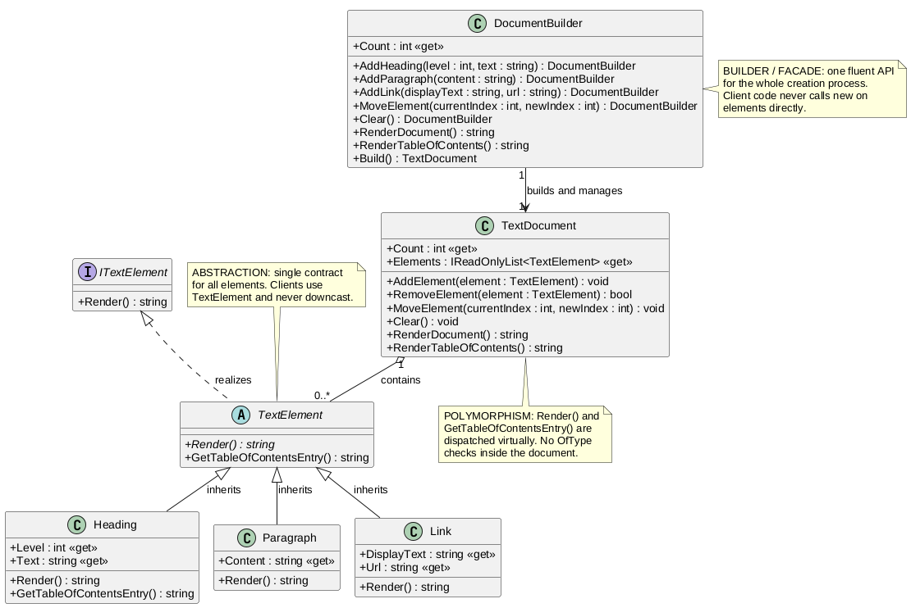

# TextSystem - структурований текст на ООП


Навчальний проєкт: система структурованого тексту на C#, перебудована на
наслідуванні, поліморфізмі й абстракції, зі створенням документів через
окремий клас-будівельник з уніфікованим API.

## Зміст

- [Можливості](#можливості)
- [Технології](#технології)
- [Структура](#структура)
- [Швидкий старт](#швидкий-старт)
- [Сумісність з версіями .NET](#сумісність-з-версіями-net)
- [Діаграма класів](#діаграма-класів)
- [Ролі класів](#ролі-класів)
- [Автор](#автор)
- [Ліцензія](#ліцензія)

## Можливості

* Елементи `Heading` / `Paragraph` / `Link` на спільному абстрактному
  `TextElement`: рендер і внесок у зміст визначає сам елемент.
* Зміст без перевірок конкретних типів: документ опитує елементи через
  віртуальний `GetTableOfContentsEntry()` (Open/Closed).
* Створення документа одним fluent-ланцюжком `DocumentBuilder`
  (`AddHeading` / `AddParagraph` / `AddLink` / `MoveElement` / `Build`).

## Технології

| Технологія | Версія / примітка |
|---|---|
| C# | 12 |
| .NET (таргет) | 8.0 (`net8.0`, `RollForward LatestMajor`) |
| .NET SDK для збірки | 8 або новіший |
| PlantUML | діаграма класів (`docs/`) |
| CI | GitHub Actions (Ubuntu + Windows) |

## Структура

```
TextSystem.csproj      - консольний застосунок, таргет net8.0
TextSystem/            - ITextElement, TextElement, Heading, Paragraph, Link,
                         TextDocument, DocumentBuilder
Program.cs             - демо-сценарій через DocumentBuilder
docs/                  - діаграма класів (.puml + .png)
```

## Швидкий старт

Потрібен [.NET 8 SDK](https://dotnet.microsoft.com/download) або новіший.

```bash
dotnet build
dotnet run
```

Очікуваний вивід:

```
========== TEXT SYSTEM ==========

--- Table of Contents ---
- Object-Oriented Programming
  - Core Principles

--- Rendered Document ---

# Object-Oriented Programming
OOP is a programming paradigm based on the concept of objects.

## Core Principles
[Read more here](https://docs.microsoft.com/dotnet/csharp/fundamentals/tutorials/oop)The four pillars are Encapsulation, Abstraction, Inheritance, and Polymorphism.
```

## Сумісність з версіями .NET

* Збірка: .NET 8 SDK або новіший - перевірено на 8.0.425 і 10.0.401.
* Запуск: рантайм .NET 8, 9 або 10 - перевірено на 8.0.31, 9.0.20 і 10.0.12,
  вивід на всіх трьох ідентичний. Проєкт таргетує `net8.0`, а
  `RollForward LatestMajor` дозволяє запуск на новіших рантаймах, коли 8.0
  не встановлено.
* Рантайми старіші за 8.0 не підійдуть.

## Діаграма класів



Повний звіт з ролями класів: `docs/TextSystem_Report.docx`.

## Ролі класів

| Клас | Роль |
|---|---|
| `ITextElement` | Мінімальний контракт рендеру, точка сумісності |
| `TextElement` | Центр абстракції: спільний тип, віртуальна точка розширення для змісту |
| `Heading` | Заголовок: рівень, markdown-рендер, рядок змісту з відступом |
| `Paragraph` / `Link` | Звичайний текст і гіперпосилання, у зміст не входять |
| `TextDocument` | Контейнер: порядок, рендер, зміст лише через поліморфні виклики |
| `DocumentBuilder` | Єдиний API створення документа, fluent-ланцюжки, фінал `Build()` |

## Автор

Воскобойников Марк, КН-31

## Ліцензія

MIT - див. [LICENSE](LICENSE).
